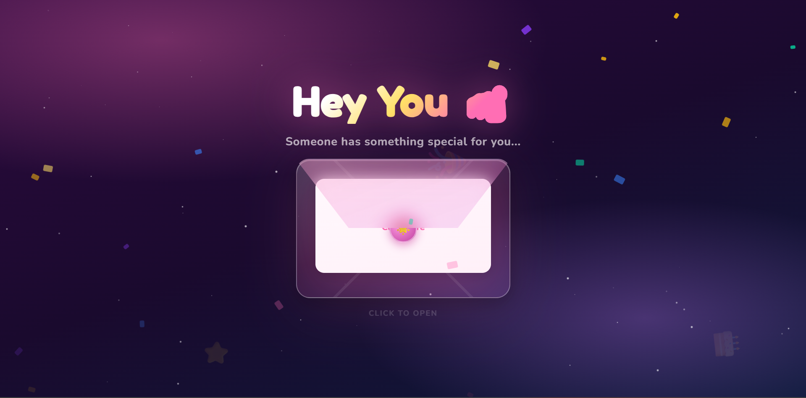

# 🎉 Happy Birthday Interactive Web

An interactive birthday-themed website built using HTML, CSS, and JavaScript.
This project is designed to deliver a fun and engaging digital greeting experience through animations, mini games, and a multi-step interaction flow.

## 🌐 Live Demo

🔗 https://wisnuuuuajii.github.io/happybirthday/

## ✨ Features

* Interactive landing page with animated elements
* Mini games (tap game, tic-tac-toe, rock paper scissors)
* Smooth transitions between pages
* Dynamic user experience with visual feedback
* Responsive design

## 🛠️ Tech Stack

* HTML
* CSS
* JavaScript

## 📸 Preview

### 🏠 Landing Page

### 🎮 Mini Game Interaction

### 🎉 Final Result

## 🚀 How to Run

1. Clone this repository
2. Open `index.html` in your browser

## 💡 Future Improvements

* Add background music control
* Improve mobile responsiveness
* Add more mini games
* Enhance animations and transitions

## 👤 Author

Wisnu
